<div align="center">


<br/><br/>

<!-- Animated terminal window: ASCII render of my avatar + a typewriter boot sequence -->


<br/>

# 🪙 Ouertani Ghaith
### `0xSilverSurfer` — Network & Security Student @ ISET'Com, Tunisia

<p><i>"Understand the packet flow, break the perimeter, automate the defense."</i></p>

<p>
  
  
  
</p>

</div>

---

### 👤 About Me

```yaml
operator:
  alias: 0xSilverSurfer
  name: Ouertani Ghaith
  academic: L3 STIC @ ISET'Com (Tunisia)
  focus: Offensive Security, Networking & SecOps Automation
  learning: Active Directory attacks, Web App Security (OWASP Top 10)
  currently_building: Automated VOC & SOAR pipeline (Docker + DefectDojo + TheHive)
```

- 🎯 Learning Red Teaming from the ground up — CTFs, machine rooting, and offensive tooling
- 🔭 Building **GhostPass**, a credential leak checker powered by the Have I Been Pwned API
- 🌐 Strong networking base from Cisco CCNA (routing, switching, VLANs, packet analysis)
- ⚙️ Exploring SecOps automation with Docker, DefectDojo, and TheHive
- 📫 Reach me at **ghaith.ouertani@edu.isetcom.tn**

---

### 🛠️ Tech Stack

<p align="center">
  
</p>

**Security Tooling**


---

### ⚡ Featured Projects

**🔑 GhostPass — Password Leak Checker**
A CLI tool that safely checks whether a password has been exposed in a data breach, using the Have I Been Pwned API and the SHA-1 k-Anonymity model so no raw password ever leaves your machine.

```bash
$ python3 ghostpass.py --check-pass "yourpassword"
[!] Hashing password locally (SHA-1)...
[*] Sending only the 5-char prefix to the HIBP API...
[+] Result: password appears in X known breaches.
```
`Python` · `HIBP API` · `SHA-1 / k-Anonymity` · `CLI`
🔗 [github.com/0xSilverSurfer/GhostPass](https://github.com/0xSilverSurfer/GhostPass)

**🛡️ Automated Vulnerability Ops Pipeline**
A small, containerized security pipeline that runs scans, sends the results into DefectDojo for vulnerability tracking, and raises cases in TheHive for anything serious — all wired together with Python and Docker.

`Docker` · `Python` · `DefectDojo` · `TheHive`

---

### 🎓 Certifications

| Certificate | Issuer |
|---|---|
| CCNA: Switching, Routing & Wireless Essentials (SRWE) | Cisco Networking Academy |
| AI Security Fundamentals | CyberWarFare Labs |
| Certified Cybersecurity Foundations | Hackviser |
| Certified Cybersecurity Educator Professional (CCEP) | Red Team Leaders |
| Certified Phishing Prevention Specialist (CPPS) | Hack & Fix |
| Python Intermediate | SoloLearn |

---


### 📫 Connect

<p align="center">
  <a href="https://www.linkedin.com/in/ouertani-ghaith-194022366/">
    
  </a>
  <a href="https://tryhackme.com/p/ghaithwertani111">
    
  </a>
  <a href="https://profile.hackthebox.com/profile/019c3f38-de43-7079-a2a0-0271620c402d">
    
  </a>
</p>

<div align="center">
  
</div>
